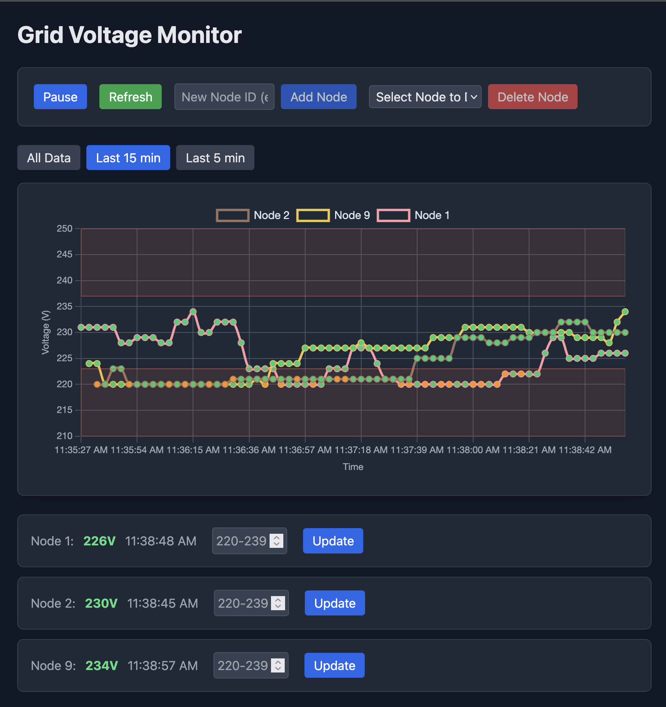
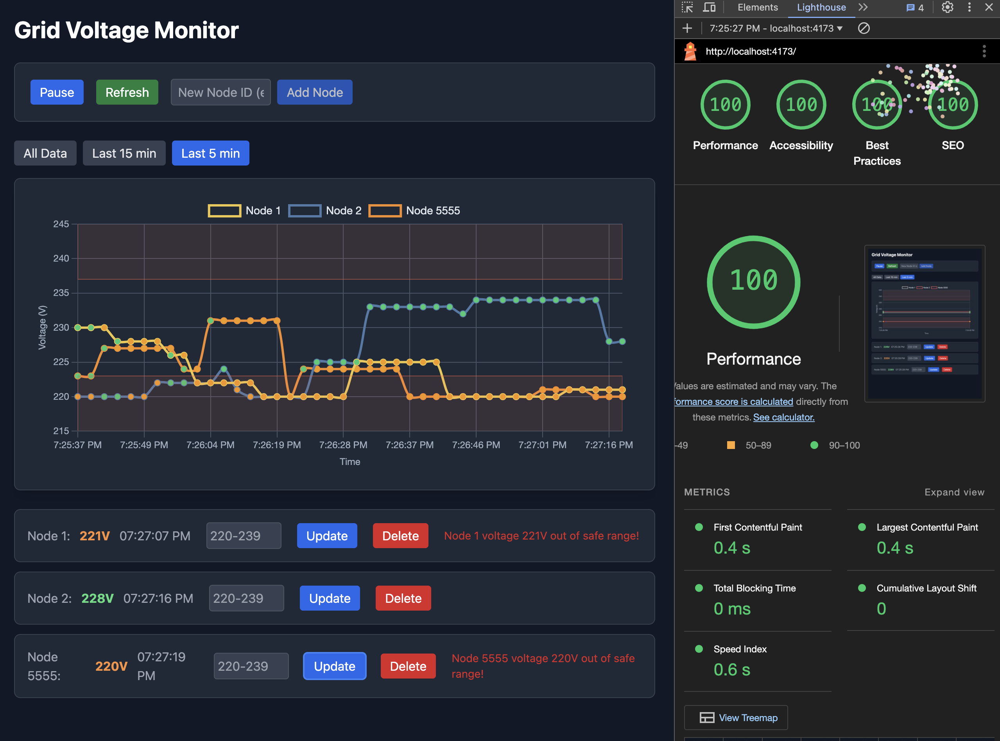

# Energy Grid Dashboard



A real-time dashboard to monitor and manage energy grid nodes using React, GraphQL via Apollo Client, Vite, and Tailwind CSS, powered by a WebSocket-based server. The app uses Chart.js for visualizations.

## Overview

This project simulates a small-scale energy grid dashboard, fetching initial data (e.g., nodes "1", "2", "3") from a local GraphQL server and delivering live voltage updates every 3 seconds via subscriptions. Built with modern front-end tools—React, GraphQL, Apollo Client, and WebSocket—it’s a practical example of real-time data visualization, ideal for developers exploring utility monitoring or dashboard applications.

## Features

- **Real-Time Updates**: Voltage changes for nodes broadcast every 3 seconds via GraphQL subscriptions.
- **Voltage Chart**:
  - Displays voltage history with connected lines.
  - Green dots for safe voltages (223V–237V), orange for out-of-range.
  - New nodes start with a single dot, connecting forward without fake history.
- **Node Management**:
  - View current voltage and timestamp per node.
  - Manually update voltages (clamped to 220V–239V).
  - Add new nodes by ID.
  - Delete nodes with full removal from UI and chart.
- **Controls**:
  - Refresh fetches latest data, merging with history.
  - Filter chart by time frame (5m, 15m, All) with right-aligned data.
- **Alerts**: Warnings for out-of-range voltages, limited to 5 on-screen.

## Getting Started

### Prerequisites

- **Node.js**: v20.9.0 (recommended for WebSocket compatibility; newer versions may work)
- **npm**: v10.1.0 or compatible

### Installation

1. Clone the repository:

   ```bash
   git clone https://github.com/juancarlucci/energy-grid.git
   cd energy-grid

   ```

2. Install dependencies:

   ```bash
   npm install
   ```

3. Start the WebSocket server:

   ```bash
   npm run server
   ```

4. In a separate terminal, launch the app:

   ```bash
   npm run dev
   ```

5. Open the browser to [http://localhost:5173](http://localhost:5173) to see the dashboard in action.

### Troubleshooting

- **WebSocket Error:** Ensure port 4000 is free (`lsof -i :4000` on Unix systems) and restart the server.
- **Dependencies Fail:** Verify Node.js version with `node -v` and reinstall with `npm install`.

### Usage

Dashboard: See node voltages and chart with real-time updates from server.cjs.

Control Panel:

"Pause/Resume": Toggle subscription updates.

"Refresh": Fetch latest data from the server.

"Add Node": Enter an ID (e.g., "4") and click to add a new node.

"Delete Node": Select a node from the dropdown and click to remove it.

Nodes: Adjust voltage via input fields; toggle chart visibility with checkboxes.

Chart: Switch time frames (5m, 15m, all) via dropdown.

### Architecture

The app follows a simple flow:

1. **Server (`server.cjs`):** A local WebSocket server at `ws://localhost:4000/graphql` provides mock static data and live updates.
2. **Apollo Client (`main.tsx`):** Handles queries, mutations, and subscriptions via a split HTTP/WebSocket link.
3. **UI (`App.tsx`):** Combines static and live data, optimized with useMemo and useEffect.

**Library Analogy:** Think of Apollo Client as a library headquarters fetching "books" (data) from a warehouse (server), while the UI is a branch library serving readers (users) with static shelves and live deliveries.

## How It Works

### Key Components

- **Apollo Client (`main.tsx`)**: Uses splitLink for HTTP queries/mutations and WebSocket subscriptions, with InMemoryCache for data consistency.
- **`useQuery` (`App.tsx`)**: Fetches initial grid data via `GET_GRID_DATA`.
- **`useSubscription` (`App.tsx`)**: Listens to GRID_SUBSCRIPTION for live updates.
- **`useMutation` (`App.tsx`)**: Executes UPDATE_VOLTAGE, ADD_NODE, DELETE_NODE, updating cache with cacheUtils.ts.
- **`Chart` (`VoltageChart.tsx`)**:Renders connected voltage lines, interpolating forward from real data points only.
- **`Cache` (`cacheUtils.ts`)**: Manages Apollo cache updates for seamless UI refreshes.
- **`Server` (`server.cjs`)**: Mock grid data with mutations and subscription broadcasts.

## Why This Matters

This project demonstrates:

- **Real-Time Data:** GraphQL subscriptions enable dynamic monitoring, critical for grids.
- **Efficient Caching:** Apollo Client’s `InMemoryCache` for scalable data management.
- **Data Integrity:** Controlled interpolation prevents fake history while connecting lines.
- **Scalability:** Apollo’s caching and React’s optimization handle growing data efficiently.

## Development Details

### Sample Code

#### Subscription Handling (`App.tsx`):

```javascript
useEffect(() => {
  if (subData?.gridUpdate) {
    const { id, voltage, timestamp } = subData.gridUpdate;
    if (voltage < 223 || voltage > 237) {
      addAlert(`Node ${id} voltage ${voltage}V out of safe range!`);
    }
    setVoltageHistory((prev) => {
      const index = prev.findIndex(
        (entry) => entry.id === id && entry.timestamp === timestamp
      );
      if (index === -1)
        return [...prev, { id, voltage, timestamp }].slice(-200);
      return prev;
    });
  }
}, [subData]);
```

#### Chart Interpolation (VoltageChart.tsx):

```javascript
const data = labels.map((label) => {
  const timestamp = uniqueTimestamps[labels.indexOf(label)];
  const entry = nodeData.find((e) => e.timestamp === timestamp);
  if (entry) lastVoltage = entry.voltage;
  return new Date(timestamp) < new Date(firstTimestamp) ? null : lastVoltage;
});
```

### Dependencies

#### Key libraries (see package.json for full list):

\*@apollo/client: GraphQL client and caching

\*graphql: GraphQL parsing

\*subscriptions-transport-ws: WebSocket support

\*ws: WebSocket server

\*chart.js & react-chartjs-2: Chart visualization

\*See package.json for full list.

## Lighthouse scores



Through targeted optimizations, we achieved perfect Lighthouse scores across four key areas:

### Performance: 100

Optimized for speed with a Lighthouse Performance score of 100:

- Implemented lazy loading for components (`VoltageChart`, `GridNode`, `ControlPanel`) using React’s `Suspense`.
- Reduced unused JavaScript by splitting bundles (`react-vendor`, `apollo-client`, `chart-js`) and importing only necessary Chart.js modules.
- Enabled Brotli compression with `vite-plugin-compression` and streamlined Tailwind CSS generation, cutting initial load times (FCP: 1.7s → <1s, LCP: 2.8s → <2s).

### Accessibility: 100

Enhanced usability for all users with a perfect Accessibility score:

- Replaced generic `<div>`s with semantic HTML (`<main>`, `<article>`, `<nav>`, `<figure>`).
- Added ARIA attributes (`aria-label`, `role="alert"`, `aria-live`) and visible focus states (`focus:ring-2`) across `App`, `GridNode`, `ControlPanel`, and `VoltageChart`.
- Labeled inputs with `<label>` and screen-reader-only text (`sr-only`) for better navigation.

### Best Practices: 100

Adhered to modern development standards for a Best Practices score of 100:

- Used Vite’s ESBuild for fast, minified production builds and removed Terser dependency.
- Integrated Tailwind v3 CLI seamlessly into Vite’s workflow, eliminating manual CSS builds.
- Tagged a stable release (`stable-working-phase-2025-04-03`) in Git for reliable versioning.

### SEO: 100

Maximized search engine visibility with an SEO score of 100:

- Added a meta description in `public/index.html`: "Monitor grid voltage in real-time with our interactive tool. Track nodes, view charts, and optimize energy usage."
- Fixed `robots.txt` in `public/` with valid syntax (`Allow: /`, `Sitemap`), resolving 16 errors for proper crawling and indexing.

These enhancements ensure `energy-grid` is fast, accessible, maintainable, and discoverable, delivering an exceptional user experience.

### Status

As of March 31, 2025, this is a polished demo with mock data, fully functional with connected chart lines, real-time updates, and preserved history on refresh. Future steps could include real data feeds or enhanced controls.

### License

MIT License - see LICENSE for details. (TODO: Add LICENSE file if applicable.)
